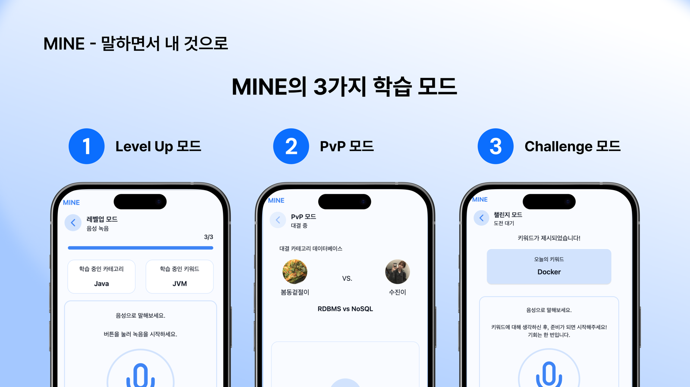
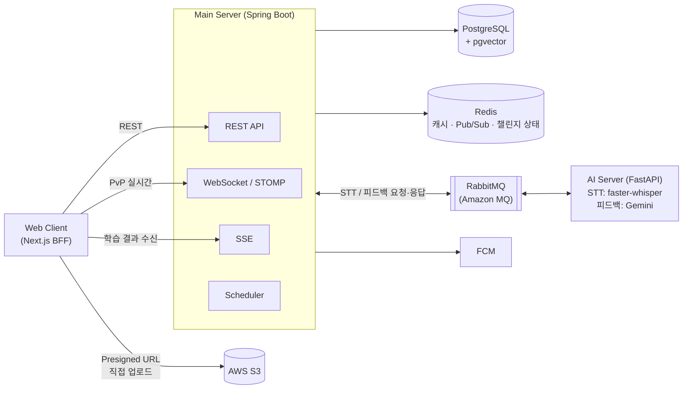
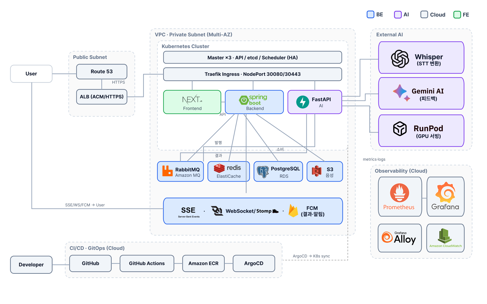
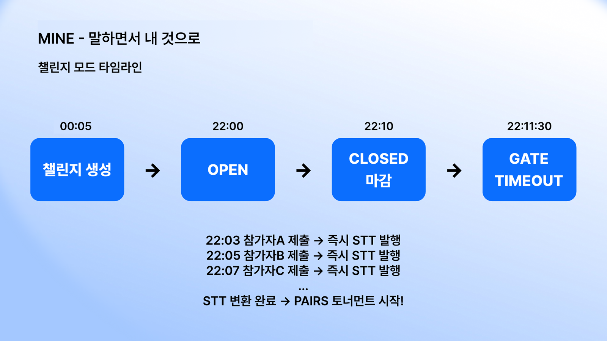
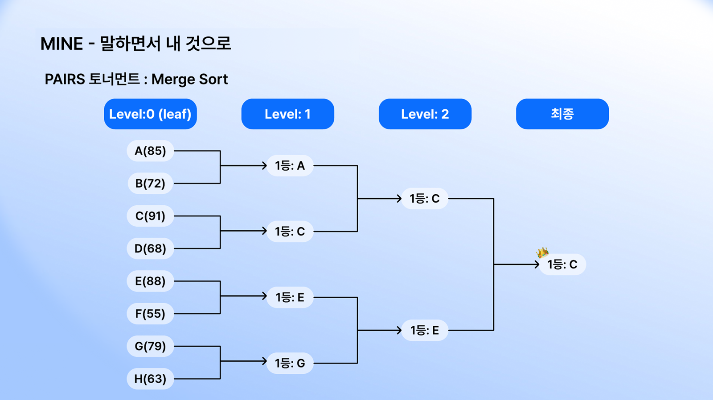

# MINE — 말하면서 내 것으로

<p align="center">
  
</p>

CS 개념을 **말로 설명**하면 AI가 잘한 점과 보완할 점을 피드백해 주는 **음성 기반 CS 학습 플랫폼**의 백엔드 레포지토리입니다. 설명할 수 있어야 아는 것이라는 생각에서 출발했습니다.

| | |
|---|---|
| 기간 | 2025.12.22 ~ 2026.03.26 (14주, MVP1 → MVP3) |
| 팀 | 6인 (BE 2 · FE 1 · Cloud 2 · AI 1) — 이 레포는 BE 2인 |
| 상태 | 프로젝트 종료 · 서비스 운영 종료 (2026-03-26, imymemine.kr) |
| 성과 | 출시 첫 주 디스콰이엇 주간 프로덕트 1위 (2026-02-09) |
| 규모 | 클라이언트 REST API 51개 · 관리자 API 8개 · 테이블 21개 · 커밋 759개 · 머지된 PR 195개 |

<br>

## 주요 기능

<p align="center">
  
  <br><sub>레벨업 · PvP · 챌린지 화면</sub>
</p>

| 모드 | 설명 |
|---|---|
| **레벨업 모드** | 키워드를 골라 말로 설명하고 AI 피드백을 받는 1인 학습. 카드당 최대 5회 반복 |
| **PvP 모드** | 실시간 1:1 대결. 같은 키워드를 동시에 녹음하고 AI가 두 설명을 비교해 승패 판정 |
| **챌린지 모드** | 매일 22:00 오픈되는 일일 챌린지. 참가자 전원을 AI 토너먼트로 비교해 랭킹 산출 |
| **알림** | 학습·PvP·챌린지 결과를 앱 내 알림과 FCM 푸시로 전달 |

<br>

## 기술 스택

| 분류 | 기술 |
|---|---|
| Language / Framework | Java 21, Spring Boot 3.4 |
| Database | PostgreSQL + pgvector, Flyway |
| ORM | Spring Data JPA (JPQL) |
| Cache / Pub-Sub | Redis (AWS ElastiCache) |
| Message Queue | RabbitMQ (Amazon MQ) |
| Realtime | WebSocket + STOMP (PvP), SSE (학습 결과) |
| Push | Firebase Cloud Messaging |
| Auth | Kakao OAuth 2.0, JWT (JJWT) — RT는 SHA-256 해시로 DB 저장, Rotation |
| Storage | AWS S3 (Presigned URL 직접 업로드) |
| Test | JUnit5, Mockito (스케줄러·배치·메시지 발행 단위 테스트), Testcontainers (PostgreSQL 통합 테스트) |
| Monitoring | Spring Actuator + Prometheus, Grafana, Sentry, k6 |
| Code Quality | Checkstyle, PMD, SpotBugs |
| CI/CD | GitHub Actions → EC2 (dev/release), Kubernetes + ArgoCD (prod) |

<br>

## 아키텍처



- **명령은 REST, 알림은 WebSocket/SSE** — 상태를 바꾸는 요청은 REST로, 서버가 알려야 하는 변화는 푸시로 분리
- **AI 처리는 전부 비동기** — 서버와 AI 서버는 RabbitMQ 큐로만 통신 (`solo.*`, `pvp.*`, `challenge.*`)
- **오디오 파일은 서버를 거치지 않음** — 클라이언트가 S3 Presigned URL로 직접 업로드. URL에는 허용된 오디오 MIME 타입(`audio/webm·mp4·m4a·mpeg·wav`)만 서명하고, PvP는 요청한 파일 크기 100MB 초과 시 발급 거부, 챌린지는 업로드 완료 시 `HeadObject`로 실제 크기(10MB)·타입을 다시 확인
- **실패 처리** — AI 응답 큐는 수동 ack(`prefetch` dev 1 · release 3 · prod 5), AI 워커가 재시도 후에도 실패하면 `status: FAIL` 응답 → 서버가 모드별로 실패 상태 전환. 업로드되지 않은 시도는 10분 뒤 `EXPIRED`

<p align="center">
  
  <br><sub>전체 서비스 인프라 — Kubernetes 클러스터·관측 스택·CI/CD는 Cloud 파트 구성</sub>
</p>

<br>

## 핵심 흐름

### 레벨업 모드

```
1. POST /cards                                   카드 생성
2. POST /cards/{cardId}/attempts                 시도 생성 (PENDING)
3. POST /learning/presigned-url                  S3 업로드 URL 발급 → 클라이언트가 S3에 직접 업로드
4. PUT  /cards/{cardId}/attempts/{id}/upload-complete    PENDING → UPLOADED
5. MQ   solo.stt.request → solo.stt.response            음성 → 텍스트
6. MQ   solo.feedback.request → solo.feedback.response  텍스트 + 채점 기준 → 피드백
7. SSE  /cards/{cardId}/attempts/{id}/stream     결과 푸시 (PROCESSING → COMPLETED / FAILED)
```

- SSE 인증: 브라우저 `EventSource`는 헤더를 못 붙이므로, `POST .../stream-token`으로 Redis 일회용 토큰을 받아 쿼리로 연결
- 10분 안에 업로드하지 않은 시도는 스케줄러가 `EXPIRED` 처리

### PvP 모드

```
OPEN → MATCHED → THINKING(30초) → RECORDING → PROCESSING → FINISHED
 방 생성   게스트 입장    생각 시간        동시 녹음      AI 분석       결과 발표
```

- 방 상태 변화는 Redis Pub/Sub → STOMP로 양쪽 클라이언트에 전달
- 양쪽 녹음 → `pvp.stt.request` × 2 → 둘 다 완료되면 `pvp.feedback.request` → 승패 판정

### 챌린지 모드

| 시각 | 단계 |
|---|---|
| 00:05 | 오늘의 챌린지 생성 |
| 22:00 | 오픈 — 제출 즉시 STT 요청 발행 (**Eager STT**, 마감까지 기다리지 않음) |
| 22:10 | 제출 마감 |
| 22:11:30 | 게이트 마감 — 마감 직전 업로드분의 늦은 업로드 완료 요청을 90초 더 수용 |

```
게이트 종료 && 남은 STT 전원 완료 (Redis active_stt_count == 0 && gate_closed)
  → PAIRS 토너먼트: 참가자를 2명씩 묶어 AI가 비교 (challenge.pairs.eval)
  → 승자를 다음 레벨로 올리며 반복 (홀수면 bye)
  → 최종 랭킹 저장 → 개인 결과 / 전체 결과 알림 + FCM
```

<p align="center">
  
  
  <br><sub>챌린지 타임라인 · PAIRS 토너먼트 (2인 비교 병합 정렬)</sub>
</p>

<br>

## 도메인 · API · DB

| 도메인 | 테이블 | 클라이언트 API |
|---|---|---|
| 회원 · 인증 · 기기 | `users`, `devices`, `user_sessions` | 11 |
| 카테고리 · 키워드 · 지식 | `categories`, `keywords`, `knowledge_base`, `forbidden_words` | 3 |
| 학습 (레벨업) | `cards`, `card_attempts`, `card_feedbacks` | 13 |
| PvP | `pvp_rooms`, `pvp_histories`, `pvp_submissions`, `pvp_feedbacks` | 11 |
| 챌린지 | `challenges`, `challenge_attempts`, `challenge_results`, `challenge_rankings` | 8 |
| 알림 | `notifications`, `notification_logs`, `notification_preferences` | 5 |
| **합계** | **21개 테이블** | **51개** (+ 관리자 8, STOMP 핸들러 2) |

- API 문서: Swagger UI (`/swagger-ui.html`)
- 스키마는 Flyway 마이그레이션(`src/main/resources/db/migration`)으로만 관리하고, 모든 환경에서 `ddl-auto: validate`

<br>

## 배치 스케줄

| 주기 | 작업 |
|---|---|
| 1분마다 | 업로드 안 된 학습 시도 만료 (PENDING 10분 초과) |
| 30분 · 1시간마다 | 유령 PvP 방 · 멈춘 제출 정리 |
| 매일 03:00 | 만료 세션 삭제, 미사용 기기 정리 |
| 매일 04:00 | 탈퇴 회원·삭제된 카드 영구 삭제 (30일 경과), 읽은 알림 정리 |
| 매일 05:00 | 오래된 알림 발송 로그 정리 |
| 매일 04:10 | 시도 없는 유령 카드 정리 (7일) |

- 챌린지 스케줄러는 여러 인스턴스에서 중복 실행되지 않도록 Redis `SETNX` 락 사용
- Knowledge Base 갱신 배치는 스케줄러를 끄고(`knowledge.batch.enabled: false`) 관리자 API(`/api/v1/admin/knowledge/batch/*`)로 수동 실행

<br>

## 기술적 도전과 해결

| 주제 | 내용 | 결과 | 담당 |
|---|---|---|---|
| 폴링 → SSE 전환 | 3초 폴링으로 AI 결과를 기다리던 구조를 SSE 푸시로 전환. 브라우저 `EventSource`의 헤더 제약을 Redis 일회용 토큰으로 해결, 구독 전·후 2단계 상태 확인으로 결과 유실 방지, heartbeat로 연결 유지 | 전환 전·후 같은 k6 시나리오 측정: `/attempts` **TPS 14 → 1.2 req/s (91%↓)**, **p95 165 → 21.1ms (87%↓)** | @baggytsk |
| 트랜잭션 경계 정합성 | 커밋 전 상태가 SSE·MQ로 먼저 노출되던 4건 수정 — 피드백 커밋 후 SSE 완료 전송, `afterCommit`에서만 MQ 발행, emitter 등록 직후 재확인, heartbeat 실패 시 자기 emitter만 제거 | 롤백된 작업의 메시지가 나가지 않고, 완료 이벤트를 놓치지 않음 | @baggytsk |
| 챌린지 랭킹 파이프라인 | 제출 즉시 STT(Eager STT) → Redis 카운터로 전원 완료 감지 → 2인 비교 PAIRS 토너먼트(LLM 상대 평가) → 랭킹·알림. 다중 인스턴스 스케줄러 중복 실행은 Redis `SETNX` 락으로 방지 | 제출부터 알림까지 사람 손 없이 자동으로 진행 | @baggytsk |
| AI 피드백용 지식 베이스 (RAG) | 사용자 피드백에서 지식을 추출해 pgvector 임베딩으로 저장, 코사인 유사도 0.7 이상 기존 지식과 비교해 중복을 거르고 AI 채점 기준으로 활용 (HNSW 인덱스) | 피드백이 쌓일수록 중복 없이 채점 기준 데이터가 늘어남 | @baggytsk |
| 인증 보안 | Refresh Token을 SHA-256 해시로 저장하고 Rotation 적용, 유저·기기당 세션 1개 고정(유니크 제약 + 동시 로그인 충돌 처리) | DB가 유출돼도 RT 원문이 드러나지 않고, 같은 기기의 중복 세션이 생기지 않음 | @baggytsk |
| 전체 알림 발송 | 챌린지 오픈 시 전체 유저 알림이 스케줄러 스레드를 막던 구조를 `@Async` 위임 + 500명 단위 조회로 분리, FCM 발송 결과는 `REQUIRES_NEW`로 독립 기록 | 유저가 늘어도 스케줄러 스레드가 막히지 않고, 전체 유저를 한 번에 메모리에 올리지 않음 | @baggytsk |
| PvP 실시간 통신 · 비동기 메시징 구조 | 방 상태는 Redis Pub/Sub → STOMP로 양쪽에 전달하고, AI 요청·응답은 RabbitMQ 큐로 분리하는 구조를 공동 설계. Redis Pub/Sub 발행·RabbitMQ 인프라(@baggytsk), WebSocket 세션 관리·PvP MQ 연동(@mamc325) | 서버가 여러 대여도 두 사용자에게 같은 방 상태가 전달되고, AI 처리가 API 서버와 분리됨 | @baggytsk · @mamc325 (공동 설계) |
| Solo 모드 MQ 전환 | HTTP 폴링을 RabbitMQ 2단계(STT → 피드백) 파이프라인으로 전환. 피처 플래그 `solo.mq.enabled`로 롤백 가능 | 서버가 AI 서버에 결과를 반복해서 묻지 않게 됨 | @mamc325 (구현) · 비동기 구조 설계는 공동 |
| N+1 제거 | PvP 방 목록 조회의 Lazy Loading을 JOIN FETCH로 교체 | 방 20개 기준 **61 → 4 쿼리** | @mamc325 |
| 벡터 검색 최적화 | 필요한 컬럼만 조회하는 Light Projection | 응답 페이로드 **132KB → 29KB** | @mamc325 |
| PvP 타이머 | `Thread.sleep` 대기를 `TaskScheduler` 예약 실행으로 교체 | 타이머 대기 동안 스레드를 붙잡지 않음 | @mamc325 |


<br>

## 팀 (Backend)

| 이름 | 담당 |
|---|---|
| 남진 [@baggytsk](https://github.com/baggytsk) (팀장) | 인증·회원, PvP 대결 진행, 알림, 챌린지 도메인 설계·구현 / SSE 결과 전달과 RAG 지식 베이스 구현 / Redis·RabbitMQ 인프라 구축, Flyway 기반 DB 스키마 관리, 데이터 정리 배치 / 스프린트·일정 관리 |
| 박성현 [@mamc325](https://github.com/mamc325) | 학습 카드·시도, PvP 방 관리, 챌린지 조회 도메인 설계·구현 / 레벨업 모드 RabbitMQ 전환, 다중 서버 환경 메시지 동기화 / DB 쿼리 개선, APM 모니터링, Testcontainers 통합 테스트 |

> 비동기 아키텍처(RabbitMQ)와 PvP 실시간 통신(WebSocket · Redis Pub/Sub)은 두 사람이 함께 설계하고, 구현은 위처럼 나눠 맡았습니다.

<br>

## 프로젝트 구조

```
src/main/java/com/imyme/mine
├── domain
│   ├── auth · user          # 카카오 로그인, JWT, 세션, 기기
│   ├── category · keyword · knowledge · forbidden   # 마스터 데이터, 지식 베이스
│   ├── card · learning      # 레벨업 모드 (카드, 시도, AI 피드백)
│   ├── pvp                  # 실시간 1:1 대결 (WebSocket)
│   ├── challenge            # 일일 챌린지, PAIRS 토너먼트
│   ├── notification         # 알림, FCM
│   ├── storage              # S3 Presigned URL
│   └── ai                   # AI 서버 연동
└── global
    ├── config · security    # Security, Redis, RabbitMQ, WebSocket 설정
    ├── messaging            # MQ · Redis Pub/Sub
    ├── sse                  # SSE Emitter 관리
    ├── scheduler            # 보관 기간 · 좀비 데이터 정리 배치
    └── error · logging · common
```

<br>

## 로컬 실행

> 서비스는 종료되었고, 아래는 코드를 직접 실행해 보고 싶을 때를 위한 안내입니다. 카카오 로그인·S3·FCM 연동에는 각 서비스의 키가 필요합니다.
>
> ⚠️ 채점(STT·피드백)은 별도 AI 서버([4-team-IMYME-ai](https://github.com/100-hours-a-week/4-team-IMYME-ai))가 RabbitMQ 큐를 소비해야 동작합니다. AI 서버 없이 실행하면 API·인증·PvP 방 관리 등은 동작하지만, 학습 시도는 채점 결과를 받지 못한 채 대기 상태에 머뭅니다. AI 응답을 대신하는 mock 환경은 준비되어 있지 않습니다.

```bash
# 1. PostgreSQL(pgvector), Redis, RabbitMQ 실행
docker compose up -d

# 2. 환경 변수 설정 후 실행 (dev 프로필)
./gradlew bootRun --args='--spring.profiles.active=dev'

# 테스트 (일부 테스트는 Testcontainers를 쓰므로 Docker 실행 필요)
./gradlew test
```

- 스키마는 애플리케이션이 시작될 때 Flyway가 `db/migration`을 자동 적용합니다. 여러 인스턴스가 동시에 떠도 Flyway가 DB 락으로 한 번만 적용합니다.

<details>
<summary>필요한 환경 변수</summary>

| 분류 | 변수 |
|---|---|
| DB | `DB_URL`, `DB_USERNAME`, `DB_PASSWORD` |
| Redis | `REDIS_HOST`, `REDIS_PORT`, `REDIS_PASSWORD` |
| RabbitMQ | `RABBITMQ_HOST`, `RABBITMQ_PORT`, `RABBITMQ_USER`, `RABBITMQ_PASSWORD` |
| 인증 | `JWT_SECRET`, `KAKAO_CLIENT_ID`, `KAKAO_CLIENT_SECRET` |
| AWS | `AWS_REGION`, `BUCKET_NAME` |
| AI 서버 | `AI_SERVER_URL`, `AI_SERVER_SECRET` |
| 기타 | `FIREBASE_SERVICE_ACCOUNT_KEY`, `SENTRY_DSN`, `CORS_ALLOWED_ORIGINS`, `FRONTEND_URL_*`, `BACKEND_URL_DEV` |

</details>

<br>

## 관련 레포지토리

- [Frontend](https://github.com/100-hours-a-week/4-team-IMYME-fe) · [AI](https://github.com/100-hours-a-week/4-team-IMYME-ai) · [Cloud](https://github.com/100-hours-a-week/4-team-IMYME-cloud) · [Wiki](https://github.com/100-hours-a-week/4-team-IMYME-wiki/wiki)
